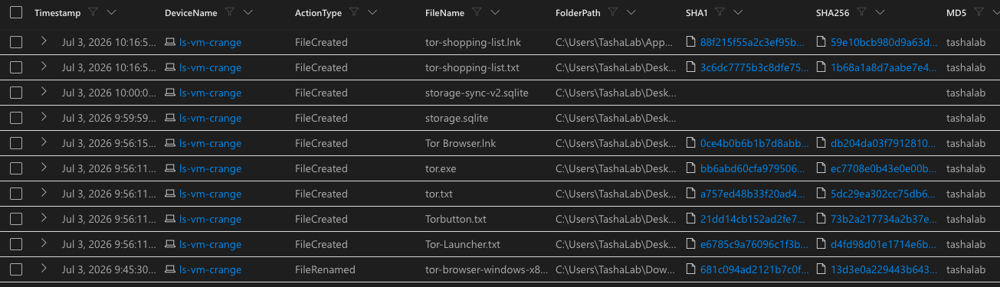
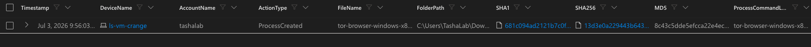
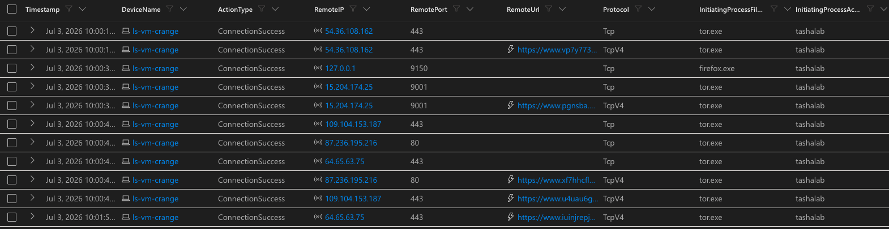
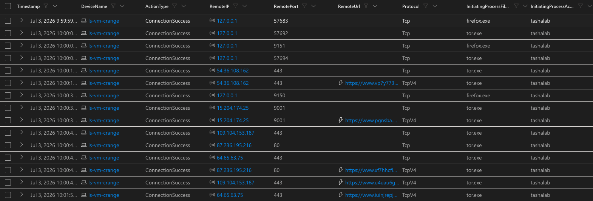
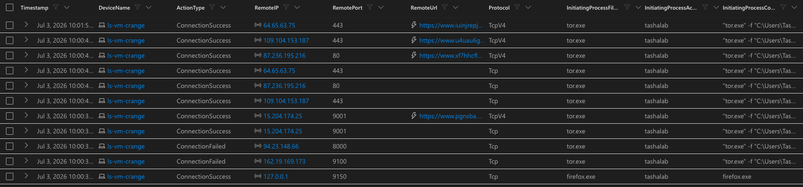

# Threat Hunt Report: Unauthorized TOR Usage
- [Scenario Creation](https://github.com/LatashaSeth/threat-hunting-scenario-tor/blob/main/threat-hunting-scenario-tor-event-creation.md) 

## Platforms and Languages Leveraged
- Windows 10 Virtual Machines (Microsoft Azure)
- EDR Platform: Microsoft Defender for Endpoint
- Kusto Query Language (KQL)
- Tor Browser

**Detection of Unauthorized TOR Browser Installation and Use on Workstation: LS-VM-Crange**

**Analyst:** Latasha Seth
**Title:** Security Analyst
**Program:** Log(n) Pacific — SOC Build Project
**Date:** July 3, 2026

---

## Scenario

Management suspects that some employees may be using TOR browsers to bypass network security controls because recent network logs show unusual encrypted traffic patterns and connections to known TOR entry nodes. Additionally, there have been anonymous reports of employees discussing ways to access restricted sites during work hours. The goal is to detect any TOR usage and analyze related security incidents to mitigate potential risks. If any use of TOR is found, notify management.

---

## Investigative Approach

To confirm or rule out TOR usage, I structured the hunt around three layers of endpoint evidence, moving from disk to process to network — each step designed to corroborate the last:

1. **File evidence first** — searched `DeviceFileEvents` for TOR- or Firefox-related file activity to establish whether TOR Browser was ever downloaded or installed on the device.
2. **Process evidence next** — searched `DeviceProcessEvents` to confirm whether the installer and browser were actually executed, not just present on disk.
3. **Network evidence last** — searched `DeviceNetworkEvents` for outbound connections on known TOR ports to confirm the browser was actively used to connect to the TOR network.

---

## Steps Taken

### 1. Searched the `DeviceFileEvents` Table

**How this was found:** A search of endpoint activity logs for the employee's device turned up multiple TOR-related files, confirming the software had been downloaded, installed, and used.

**What happened:** The employee downloaded and installed the TOR Browser — software that anonymizes internet activity and bypasses standard security monitoring — then used it within the same work session.

**Bottom line:** The pattern of activity points to deliberate installation and use, not an accidental download. Full findings and recommended next steps are detailed below.

**Query used to locate events:**

```kql
DeviceFileEvents
| where DeviceName == @"ls-vm-crange"
| where InitiatingProcessAccountName == @"tashalab"
| where FileName contains "tor"
| where Timestamp >= datetime(2026-07-03T13:45:30.0682077Z)
| order by Timestamp desc
| project Timestamp, DeviceName, ActionType, FileName, FolderPath, SHA1, SHA256, MD5 = InitiatingProcessAccountName
```



### Key Observations

- **9:45 AM** — The TOR Browser installer was downloaded to the Downloads folder.
- **9:56 AM** — The installer was actually run (using a silent-install command, meaning no pop-ups or confirmation screens) — the kind of install method someone uses when they don't want it noticed. Seconds later, TOR-related files appeared on the Desktop.
- **Shortly after** — Browser profile files appeared, showing TOR had generated session data.
- **~20 minutes later** — A file called `tor-shopping-list.txt` was created, showing the browser was actively being used, not just installed and ignored.

**Bottom line:** The activity pattern is consistent with manual installation and use, rather than an automated or background process.

### 2. Searched the `DeviceProcessEvents` Table

**Query used to locate events:**

```kql
DeviceProcessEvents
| where DeviceName == @"ls-vm-crange"
| where FileName contains "tor"
| where ProcessCommandLine contains "tor-browser-windows-x86_64-portable-15.0.17.exe  /S"
| project Timestamp, DeviceName, AccountName, ActionType, FileName, FolderPath, SHA1, SHA256, MD5, ProcessCommandLine
```



### Key Observations

- **9:56 AM** — The installer wasn't just sitting in Downloads — it was actually run, seconds before the TOR files appeared on the Desktop.
- The `/S` in the command means **silent install**: no pop-ups, no confirmation screens. It's the install method someone uses when they don't want it noticed.
- This confirms an automated process didn't cause the file activity — a person actively launched the TOR Browser installer on this device.

**Query used to locate events:**

```kql
DeviceProcessEvents
| where DeviceName == @"ls-vm-crange"
| where AccountName == @"tashalab"
| where FileName has_any ("firefox.exe", "tor.exe")
| where Timestamp >= datetime(2026-07-03T09:56:00Z)
| project Timestamp, DeviceName, AccountName, ActionType, FileName, FolderPath, ProcessCommandLine, InitiatingProcessFileName
| order by Timestamp asc
```



### Key Observations

- **9:59:51 AM** — `firefox.exe` was launched with `explorer.exe` as the initiating process. This means the browser was opened by a person double-clicking an icon or shortcut — not by a script or automated task.
- The following `firefox.exe` entries are normal browser behavior (Firefox spawning internal content processes as the window opens) — not separate launches.
- `tor.exe` then started, launched by `firefox.exe` itself — confirming the TOR network client came up as part of that same browser session.

**Bottom line:** This confirms the TOR Browser wasn't just installed and left alone — it was manually opened and used by the account holder.

**Query used to locate events:**

```kql
DeviceNetworkEvents
| where DeviceName == @"ls-vm-crange"
| where InitiatingProcessFileName has_any ("tor.exe", "firefox.exe", "tor-browser.exe")
| project Timestamp, DeviceName, ActionType, RemoteIP, RemotePort, RemoteUrl, Protocol, InitiatingProcessFileName, InitiatingProcessAccountName, InitiatingProcessCommandLine
| order by Timestamp desc
```


### Key Observations

- Between 10:00 AM and 10:01 AM, `tor.exe` made multiple successful outbound connections from the device — confirming the browser wasn't just installed; it was actively connecting out to the internet.
- One connection went out over **port 9001**, a port commonly associated with TOR relay traffic — a strong technical indicator of TOR network activity.
- Two connection attempts **failed** (to `94.23.148.66:8000` and `162.19.169.173:9100`) — this is consistent with normal TOR behavior, where the client attempts multiple relays while building a circuit and only some connections succeed.
- The remaining successful connections went out over standard web ports (443/80), which is expected: TOR is designed to blend in with normal encrypted web traffic. The key detail is that `tor.exe` — not a standard browser — was the process making these connections.
- All connections trace back to the same device (`ls-vm-crange`) and user (`tashalab`) seen throughout this investigation.

**Bottom line:** Outbound network activity confirms the TOR Browser wasn't just installed — it was actively used to connect to the internet, corroborating the file and process evidence above.

**Query used to locate events:**

```kql
DeviceNetworkEvents
| where DeviceName == @"ls-vm-crange"
| where InitiatingProcessAccountName != "system"
| where InitiatingProcessFileName has_any ("tor.exe", "firefox.exe")
| where ActionType == "ConnectionSuccess"
| project Timestamp, DeviceName, ActionType, RemoteIP, RemotePort, RemoteUrl, Protocol, InitiatingProcessFileName, InitiatingProcessAccountName
| order by Timestamp asc
```



### Key Observations

- **9:59:59–10:00:03 AM** — `firefox.exe` and `tor.exe` connected to each other locally (127.0.0.1) on ports 9150/9151 — TOR's default SOCKS proxy and control ports. This is the browser handing its web traffic off to the TOR client to be routed anonymously, and only happens when TOR Browser is actively opened and used.
- **10:00:03 AM onward** — `tor.exe` began making outbound connections to external IP addresses over ports 443, 80, and 9001 — this is the anonymized browsing traffic leaving the machine through the TOR network.
- Every connection in this sequence — local and outbound — traces back to `tashalab` on `ls-vm-crange`.

**Bottom line:** This query captures the full TOR session end to end — the local proxy handshake between the browser and the TOR client, followed by outbound relay traffic — confirming active, anonymized web browsing took place.

**Query used to locate events:**

```kql
DeviceNetworkEvents
| where DeviceName == @"ls-vm-crange"
| where InitiatingProcessAccountName != "system"
| where InitiatingProcessFileName has_any ("tor.exe", "firefox.exe")
| where ActionType == "ConnectionSuccess"
| where RemotePort in (80, 443, 9001, 9030, 9050, 9150)
| project Timestamp, DeviceName, ActionType, RemoteIP, RemotePort, RemoteUrl, Protocol, InitiatingProcessFileName, InitiatingProcessAccountName
| order by Timestamp asc
```



### Key Observations

- **10:00:3x AM** — `firefox.exe` connected locally to `127.0.0.1:9150`, TOR's default SOCKS proxy port — confirming the browser handed its traffic to the TOR client.
- `tor.exe` then made multiple outbound connections to external IP addresses over **port 9001** (TOR's standard relay port) as well as standard web ports **443 and 80** — including resolved URLs such as `pgnsba.com`, `vp7y773...`, `xf7hhcfl...`, and `u4uau6g...`.
- Combining TOR's own ports with standard web ports in one view shows the complete picture: the local handoff to TOR, followed by TOR relaying the browsing session out over both TOR-specific and standard web ports.

**Bottom line:** This confirms sustained TOR-routed browsing activity — a mix of TOR relay traffic and web traffic carried through the TOR network — all tied back to `tashalab` on `ls-vm-crange`.

---

## Chronological Events

### 1. File Download — TOR Browser Installer

- **Timestamp:** Jul 3, 2026 9:45:30 AM
- **Event:** User `tashalab` downloaded/renamed the file `tor-browser-windows-x86_64-portable-15.0.17.exe`.
- **Action:** FileRenamed detected.
- **File Path:** `C:\Users\TashaLab\Downloads\tor-browser-windows-x86_64-portable-15.0.17.exe`

### 2. Process Execution — TOR Browser Installation

- **Timestamp:** Jul 3, 2026 9:56:03 AM
- **Event:** User `tashalab` executed the file `tor-browser-windows-x86_64-portable-15.0.17.exe` in silent mode, initiating a background installation of the TOR Browser.
- **Action:** Process creation detected.
- **Command:** `tor-browser-windows-x86_64-portable-15.0.17.exe /S`
- **File Path:** `C:\Users\TashaLab\Downloads\tor-browser-windows-x86_64-portable-15.0.17.exe`

### 3. File Creation — TOR Browser Components

- **Timestamp:** Jul 3, 2026 9:56:11–9:56:15 AM
- **Event:** TOR Browser component files (`tor.exe`, `Tor Browser.lnk`, `Torbutton.txt`, `Tor-Launcher.txt`) were created on the Desktop, followed by browser profile files (`storage.sqlite`, `storage-sync-v2.sqlite`).
- **Action:** Multiple FileCreated events detected.
- **File Path:** `C:\Users\TashaLab\Desktop\...`

### 4. Process Execution — TOR Browser Launch

- **Timestamp:** Jul 3, 2026 9:59:51 AM
- **Event:** User `tashalab` opened the TOR Browser. `firefox.exe` was launched with `explorer.exe` as the initiating process, indicating a manual launch. `tor.exe` was subsequently launched by `firefox.exe`.
- **Action:** Process creation of TOR Browser-related executables detected.
- **File Path:** `C:\Users\TashaLab\Desktop\...\firefox.exe`

### 5. Network Connection — TOR Local Handoff

- **Timestamp:** Jul 3, 2026 9:59:59–10:00:03 AM
- **Event:** A local connection to `127.0.0.1` on port `9150` was established using `firefox.exe`, confirming the browser handed its traffic to the TOR client.
- **Action:** Connection success.
- **Process:** `firefox.exe`

### 6. Network Connection — TOR Relay Traffic

- **Timestamp:** Jul 3, 2026 10:00:38 AM
- **Event:** An outbound network connection to IP `15.204.174.25` on port `9001` was established using `tor.exe`, resolving to `pgnsba.com` — confirming TOR relay network activity.
- **Action:** Connection success.
- **Process:** `tor.exe`

### 7. Additional Network Connections — TOR Browser Activity

- **Timestamps:**
  - 10:00:4x AM — Connected to `109.104.153.187` on port 443
  - 10:00:4x AM — Connected to `87.236.195.216` on port 80
  - 10:00:4x AM — Connected to `64.65.63.75` on port 443
  - 10:01:5x AM — Connected to `64.65.63.75` on port 443, resolving to a `iuinjrepj...` URL
- **Event:** Additional outbound connections were established through `tor.exe`, indicating ongoing browsing activity routed through the TOR network.
- **Action:** Multiple ConnectionSuccess events detected.

### 8. File Creation — TOR Shopping List

- **Timestamp:** Jul 3, 2026 ~10:00 AM (approx. 20 minutes after installation)
- **Event:** User `tashalab` created a file named `tor-shopping-list.txt` on the Desktop, indicating active use of the TOR Browser rather than a dormant install.
- **Action:** FileCreated event detected.
- **File Path:** `C:\Users\TashaLab\Desktop\tor-shopping-list.txt`

---

## Summary

Endpoint activity logs on `ls-vm-crange` show that user `tashalab` downloaded, silently installed, manually opened, and actively used the TOR Browser over the course of roughly 16 minutes on July 3, 2026 — from the initial download at 9:45 AM through sustained outbound browsing activity past 10:01 AM. File evidence confirms the installer arrived in Downloads and its components appeared on the Desktop; process evidence confirms both the silent installation and the manual browser launch (via `explorer.exe`); and network evidence confirms the browser successfully connected to the TOR network — first through a local proxy handshake, then through outbound relay traffic to multiple external IP addresses on both TOR-specific and standard web ports. Together, these three data sources corroborate one another and support a single conclusion: TOR was intentionally installed and used on this device during business hours.

---

## Response Taken

TOR usage was confirmed on endpoint `ls-vm-crange`. The device was isolated and the user's direct manager was notified.
---
